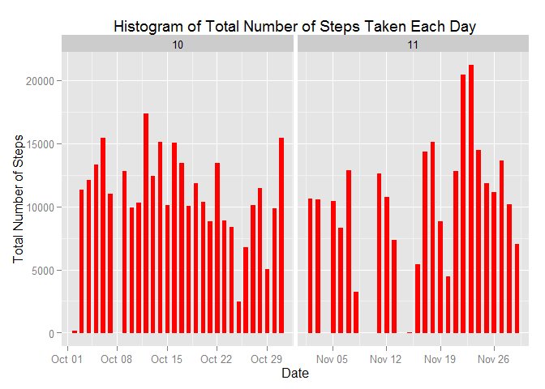
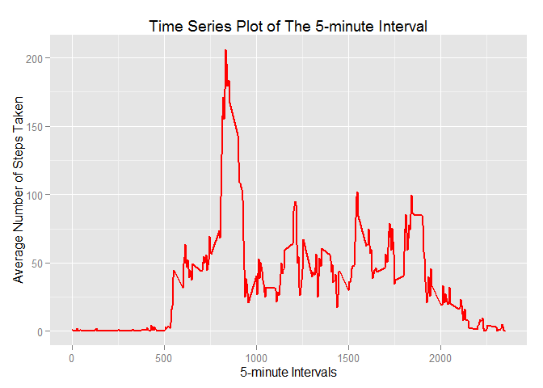
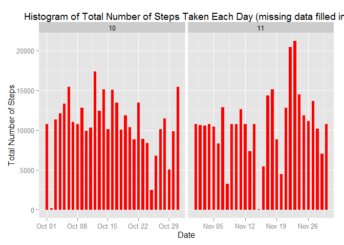

# Reproducible Research: Peer Assessment 1
Created by H.Wang on November 12, 2015


## Basic Settings

```r
echo= TRUE  # make scripts visible to others
```
## Loading and preprocessing the data


```r
# 1. Load the data
unzip("activity.zip")
data <- read.csv("activity.csv", colClasses = c("integer", "Date", "factor"))
# 2. Process/transform the data
data$month <- as.numeric(format(data$date, "%m"))
data_noNA <- na.omit(data)
rownames(data_noNA) <- 1:nrow(data_noNA)
dim(data_noNA)
```

```
## [1] 15264     4
```

## What is mean total number of steps taken per day?

```r
# 1. Calculate the total number of steps taken per day
steps_total <- aggregate(data_noNA$steps, list(Date = data_noNA$date), FUN = "sum")
colnames(steps_total) <- c("date", "steps")
steps_total
```

```
##          date steps
## 1  2012-10-02   126
## 2  2012-10-03 11352
## 3  2012-10-04 12116
## 4  2012-10-05 13294
## 5  2012-10-06 15420
## 6  2012-10-07 11015
## 7  2012-10-09 12811
## 8  2012-10-10  9900
## 9  2012-10-11 10304
## 10 2012-10-12 17382
## 11 2012-10-13 12426
## 12 2012-10-14 15098
## 13 2012-10-15 10139
## 14 2012-10-16 15084
## 15 2012-10-17 13452
## 16 2012-10-18 10056
## 17 2012-10-19 11829
## 18 2012-10-20 10395
## 19 2012-10-21  8821
## 20 2012-10-22 13460
## 21 2012-10-23  8918
## 22 2012-10-24  8355
## 23 2012-10-25  2492
## 24 2012-10-26  6778
## 25 2012-10-27 10119
## 26 2012-10-28 11458
## 27 2012-10-29  5018
## 28 2012-10-30  9819
## 29 2012-10-31 15414
## 30 2012-11-02 10600
## 31 2012-11-03 10571
## 32 2012-11-05 10439
## 33 2012-11-06  8334
## 34 2012-11-07 12883
## 35 2012-11-08  3219
## 36 2012-11-11 12608
## 37 2012-11-12 10765
## 38 2012-11-13  7336
## 39 2012-11-15    41
## 40 2012-11-16  5441
## 41 2012-11-17 14339
## 42 2012-11-18 15110
## 43 2012-11-19  8841
## 44 2012-11-20  4472
## 45 2012-11-21 12787
## 46 2012-11-22 20427
## 47 2012-11-23 21194
## 48 2012-11-24 14478
## 49 2012-11-25 11834
## 50 2012-11-26 11162
## 51 2012-11-27 13646
## 52 2012-11-28 10183
## 53 2012-11-29  7047
```

```r
# 2. Make a histogram of the total number of steps taken each day
library(ggplot2)
ggplot(data_noNA, aes(date,steps)) + geom_bar(stat = "identity", colour = "red", fill = "red", width = 0.5) + facet_grid(. ~ month, scales = "free") + labs(title ="Histogram of Total Number of Steps Taken Each Day", x = "Date", y = "Total Number of Steps")
```

 

```r
# 3. Calculate and report the mean and median of the total number of steps taken per day
mean(steps_total$steps)
```

```
## [1] 10766.19
```

```r
median(steps_total$steps)
```

```
## [1] 10765
```

## What is the average daily activity pattern?

```r
# 1. Make a time series plot of the 5-minute interval (x-axis) and the average number of steps taken, averaged across all days (y-axis)
steps_avg <- aggregate(data_noNA$steps, list(interval = as.numeric(as.character(data_noNA$interval))), FUN = "mean")

ggplot(steps_avg, aes(interval, steps_avg$x)) + geom_line(color = "red", size = 0.8) + labs(title = "Time Series Plot of The 5-minute Interval",x = "5-minute Intervals", y = "Average Number of Steps Taken")
```

 

```r
# 2. Which 5-minute interval, on average across all the days in the dataset, contains the maximum number of steps?
steps_avg[steps_avg$x == max(steps_avg$x),]
```

```
##     interval        x
## 104      835 206.1698
```
## Imputing missing values

```r
# 1. Calculate and report the total number of missing values in the dataset
sum(is.na(data))
```

```
## [1] 2304
```

```r
# 2. Filling in all of the missing values in the dataset (use the mean for the 5-minute interval)
newdata <- data
for (i in 1:nrow(data)) {
  if (is.na(newdata$steps[i])) {
    newdata$steps[i] <- steps_avg[which(newdata$interval[i] == steps_avg$interval),]$x
  }
}

# 3. Create a new dataset that is equal to the original dataset but with the missing data filled in
head(newdata)
```

```
##       steps       date interval month
## 1 1.7169811 2012-10-01        0    10
## 2 0.3396226 2012-10-01        5    10
## 3 0.1320755 2012-10-01       10    10
## 4 0.1509434 2012-10-01       15    10
## 5 0.0754717 2012-10-01       20    10
## 6 2.0943396 2012-10-01       25    10
```

```r
# 4. Make a histogram of the total number of steps taken each day, Calculate and report the mean and median total number of steps taken per day, what is the impact of imputing missing data?
ggplot(newdata, aes(date,steps)) + geom_bar(stat = "identity", colour = "red", fill = "red", width = 0.5) + facet_grid(. ~ month, scales = "free") + labs(title ="Histogram of Total Number of Steps Taken Each Day (missing data filled in)", x = "Date", y = "Total Number of Steps")
```

 

```r
new_steps_total <- aggregate(newdata$steps, list(Date = newdata$date), FUN = "sum")

mean(new_steps_total$x)
```

```
## [1] 10766.19
```

```r
median(new_steps_total$x)
```

```
## [1] 10766.19
```

```r
# Comparison (new - old)
mean(new_steps_total$x) - mean(steps_total$steps)
```

```
## [1] 0
```

```r
median(new_steps_total$x) - median(steps_total$steps)
```

```
## [1] 1.188679
```
The results above show that mean value of new data with missing values filled in stays same with that of old data but new median of total seps taken per day is greater than the old data median.  

## Are there differences in activity patterns between weekdays and weekends?


```r
## Use the dataset with the filled-in missing values for this part
# 1. Create a new factor variable in the dataset with two levels - "weekday" and "weekend"
newdata$days <- factor(format(newdata$date, "%A"))
levels(newdata$days) <- list(weekday = c("Monday", "Tuesday","Wednesday","Thursday","Friday"), weekend = c("Saturday", "Sunday"))
levels(newdata$days)
```

```
## [1] "weekday" "weekend"
```

```r
# 2. Make a panel plot containing a time series plot (i.e. type = "l") of the 5-minute interval (x-axis) and the average number of steps taken, averaged across all weekday days or weekend days (y-axis)
new_steps_avg <- aggregate(newdata$steps, list(interval = as.numeric(as.character(newdata$interval)), days = newdata$days), FUN = "mean")

head(new_steps_avg)
```

```
##   interval    days          x
## 1        0 weekday 2.25115304
## 2        5 weekday 0.44528302
## 3       10 weekday 0.17316562
## 4       15 weekday 0.19790356
## 5       20 weekday 0.09895178
## 6       25 weekday 1.59035639
```

```r
library(lattice)
xyplot(new_steps_avg$x ~ new_steps_avg$interval | new_steps_avg$days, layout= c(1,2), type = "l", xlab = "Interval", ylab = "Number of steps")
```

 


